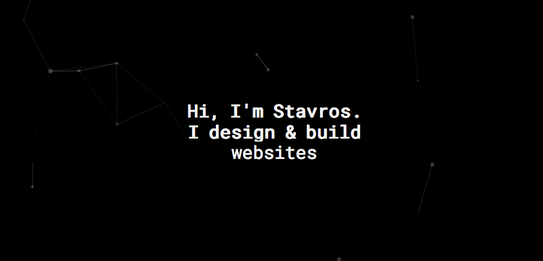

<h1 align="center">
	
</h1>

> My Nuxt.js based developer website

[](https://travis-ci.org/stavros-liaskos/stavrosliaskos) [](https://greenkeeper.io/) [](https://coveralls.io/github/stavros-liaskos/stavrosliaskos?branch=master)

## Build Setup

``` bash
# install dependencies
$ yarn

# serve with hot reload at localhost:3000
$ yarn dev

# build for production and launch server
$ yarn build
$ yarn start

# generate static project (used at production server)
$ yarn generate
```
Or if you prefer npm:
``` bash
# install dependencies
$ npm i

# serve with hot reload at localhost:3000
$ npm run dev

# build for production and launch server
$ npm run build
$ npm run start

# generate static project (used at production server)
$ npm run generate
```

For detailed explanation on how things work, checkout the [Nuxt.js docs](https://github.com/nuxt/nuxt.js).

## Structure
- `archive` is used to store initial assets(before processing)

## Images
Images are cropped using [ImageMagick](https://www.imagemagick.org/script/index.php) and compressed using [TinyPng](https://tinypng.com/).       
`convert archive/original.png -gravity center -resize 350x240\^ -crop 350x240+0+0 +repage static/converted.png`  
Original images are stored at `/archive` for future use and the production ones under `/static`, [here is why](https://nuxtjs.org/guide/assets#static)

## Now
Deploy `master` with now to https://stavros.online/:
```shell
yarn deploy
```

## Useful Links
- [Nuxt layouts](https://www.youtube.com/watch?v=YOKnSTp7d38)  
- [Typed.js](https://www.npmjs.com/package/vue-typer#getting-started)

## TODO
- [decrease font and icons file size](http://fontello.com/)
- fade in to improve user's speed perspective
- contact section and form (connect to BE)  
- use srcset for RW images (fix device bug: project card images not centered)
- hover vs click effect at project cards on device mode? [this hack to the resque?!](https://codepen.io/MartijnCuppens/pen/GZWgaQ?editors=1100)
https://caferati.me/labs/seo-part-one-google-search-for-full-stack-developer-portfolio
- create plugin for FontFaceObserver and fix false negative error in promise
- [implement router link if it makes sense...](https://router.vuejs.org/en/api/router-link.html)
- fix console errors (typed js) | also slows down a lot "yarn dev"
- [static html fallback]( https://github.com/nuxt/nuxt.js/issues/2120)
- create favicon (apple icon, ie 8, ie9 etc...)
- what is the vue way to do animationend?
- improve asides: they must be dynamic and decrease until the next breakpoint (just like in bootstrap)
- [Install App-Wide Components & Directives](https://alligator.io/vuejs/creating-custom-plugins/)
- [redirects issue from seo checker](https://github.com/nuxt/nuxt.js/issues/1592)
- add logo
- logo in device mode: hide letters and pull svg to left
- remove stavrosliaskos.com from footer
- include social links in device mode in contact section
- disable horizontal scrolling in iphone
- horizontal list and scrolling project cards in device mode 
- 404 page doesn't work on production
- [fix coverage ](https://nuxtjs.org/examples/testing/)
- [add some headers](https://pwa.nuxtjs.org/modules/meta.html)
- maybe give [this](https://github.com/shshaw/splitting/) a try? looks fancy


## Pages
/   
/about   
/contact   
/privacy-policy   
/404   

## Ranking
Google Audits:
> Mobile
> - 100 Performance 
> - 45 PWA          
> - 84 Accessibility
> - 88 Best Practices
> - 100 SEO

> Desktop
> - 100 Performance 
> - 36 PWA          
> - 84 Accessibility
> - 88 Best Practices
> - 100 SEO

[page speed insights](https://developers.google.com/speed/pagespeed/insights/) 100 mobile / 100 desktop

[sitechecker](https://sitechecker.pro/) : 97%  

[structured data](https://search.google.com/structured-data/testing-tool/):  0/0/0
 
[structured data linter](http://linter.structured-data.org/): 0 

[mobile friendly test](https://search.google.com/test/mobile-friendly): passed  

## CLI Checker
Using [Webhint](https://webhint.io/) :

```
yarn hint
```

## License

The code is available under the [MIT license](LICENSE).
